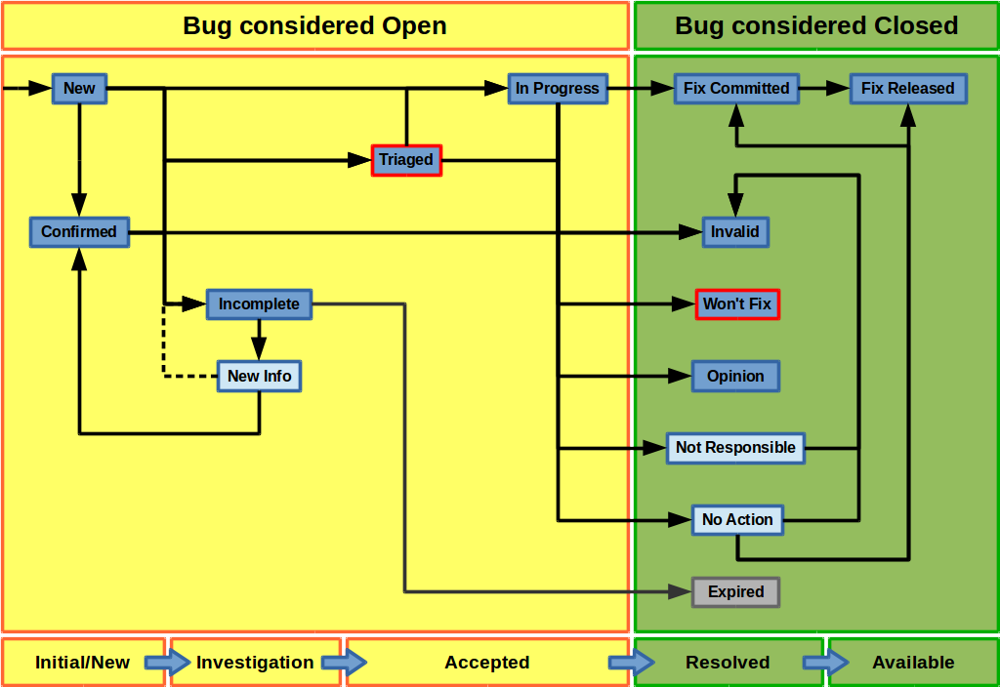

=============================
Getting involved
=============================

There are many ways to help out, and they don't all involve coding.

-----------------------------
Translations
-----------------------------

Sprechen Sie Deutsch?

Awesome! I've been getting my head around the whole translation
bit (English monoglot I'm afraid), and as a result there has been
a lot of churn in the translations. So what are you waiting for?

Speak some other language? Take a look at
https://translations.launchpad.net/terminator because you might
just be the <insert language here> speaker that we're looking for.

-----------------------------
Improve icons/artwork
-----------------------------

OK, so while the main icon contributed by Cory Kontros is really
good, my hacks of it are... not so good. I'm no artist, but I do
appreciate them. So if you think you could apply some polish and
a cohesive design to this manuals page header images, please, give
it a go. It may only be to take the existing icon and to make it
suck less.

The only thing I would ask is that you maintain the main icon as
a base like I have done.

-----------------------------
Terminator action shots
-----------------------------

This one's just for "PR" purposes. I want to see famous/awesome
people kicking ass *and* chewing bubble-gum with Terminator in the
mix.

If you spot it in a TV show, movie, or a news article I want to
know. Maybe you're even the famous/awesome person, in which case
drop me a note.

It will warm the cockles of my heart to know that Terminator made
life easier for people who do the really important stuff like
discovering new particles (CERN? Hello?), boldly going (NASA? Come
in Houston), or wrangle 2 more frames per second from Half-Life 3
(Valve? Confirmed?)

Here's the ones I've spotted and noted (I've seen quite a few others
previously, but never thought to note them)

- `MindMaze`_ - VR / mind-reading.
    Visible in the background of the video, and in an image lower down
    the page. (The Verge)

.. _MindMaze: http://www.theverge.com/2015/3/3/8136405/mind-maze-mind-leap-thought-reading-virtual-reality-headset

-----------------------------
Manual updates
-----------------------------

This manual is a new endeavour to fully document all the nooks and
crannies of Terminator. As such, there may be things that are missing,
incorrect, not explained clearly, or need expanding.

Suggestions, or updates are welcome.

I had a little exposure at work to Sphinx, so I thought I'd dig in
a bit deeper and learn  a bit about it. So far I'm happy enough, so
till further notice this manual will remain in this format.

If you're feeling like a loquacious polyglot you could attempt to
translate the whole manual. So far I haven't tested it, but in
principle, just do a checkout of the trunk, and do a full copy of
the ``doc/manual`` folder to ``doc/manual_XXXX`` where XXXX is the
i18n language code. This is usually just the two or three letters of
the language code, but sometimes has the region too... Or something
else entirely in a couple of cases.  A couple of examples::

  pt            - Portugese
  pt_BR         - Brazilian Portugese
  ca            - Catalan
  ca@valencia   - Catalan (Dialect specific to Valencia?)
  
Then just translate away, and take new screen grabs to replace the
British English ones I've done. If someone was to make a serious
effort to translate the manual, I'm sure we can get it included.

The Help shortcut checks the LANGUAGE environment variable, and tries
those folders in order, before falling back gracefully to the default
manual, which is British English anyway::

  LANGUAGE=en_GB:en

So this is going to try:

+ *html_en_GB* - the non-existent British English folder
+ *html_en* - the non-existent generic English folder
+ *html* - the default document that happens to be in British English

.. note:: Although the source is in a folder beginning with ``manual``,
          that gets replaced with ``html`` for installation.

.. note:: If there are any Americans offended by correct spelling,
          they are more than welcome to create an Americanised
          version, and I'll relegate it to the en_US folder. The
          default will remain British English.

In order to create the html for the manual, you must have the
sphinx_rtd_theme package installed. This does not appear to be
packaged for Ubuntu 14.04 LTS as far as I can tell. This means you
must install it using the pip tool. This may need installing on your
system too with::

    sudo apt-get install python-pip

Once that is installed you can install the theme with::

    sudo pip install sphinx-rtd-theme

This will take care of installing the theme and it's dependencies.

.. warning:: On Ubuntu this also installed a newer version of *Sphinx*
             under the ``/usr/local`` folder. This caused a bit of
             confusion at one point, so be aware.

-----------------------------
Testing
-----------------------------

Just use it, explore the features, and complain when they don't work.

We actually have quite a lots of outstanding issues, and in many
cases I can't reproduce due to either lack of info, differences in
environment, lack of information, or because the bug is so old the
original raiser has moved on and not available for questions.

I'm particularly interested in cases where I can't even see that
something is an issue, such as:

- *Right-to-Left* - I can force Terminator to Arabic, and everything
  flips around, but I have no idea if it looks "right" to a native
  speaker. Frankly it just looks *weird!*
- *HighContrast* - Again, I can switch to it, but perhaps I'm not
  appreciating the needs of that group.
- *Accessibility* - People using only a keyboard, or only a mouse,
  on-screen keyboards, text-to-speech, speech-to-text, and so on.

-----------------------------
Bugs
-----------------------------

Bugs (and feature requests) are raised and dealt with in the Launchpad
`bugs`_ page.

.. _bugs: https://bugs.launchpad.net/terminator

- **Fixing** - OK, so yeah, this is coding.
- **Reproduce and improving** - Sometimes bugs are lacking info to
  reproduce, or my system is too different. Or perhaps the original
  poster has moved on because we haven't fixed their pet peeve fast
  enough.
- **Triaging** - It's one of the less glamorous jobs, but someone's
  gotta do it. Shepherd bugs to the point where it has a priority,
  a milestone, reproduction steps, confirmation, submitted patches
  validated, and so on.
- **Raising** - If you have searched and cannot find your bug, you
  can raise a new one.

Feature requests are initially raised as bugs, and if it passes the
rather undefined criteria, it will be marked as a **wishlist** item.

Bug handling
^^^^^^^^^^^^
I have had one person (possibly others) who are hesitant to use the
status' because they've been "told off" by the developers of other
projects, and people/projects are often different in how they want to
handle bugs. So, with that in mind, let me present my idea of how a
bug should be handled. First a pretty picture:

So, the darker blue states are the ones available in Launchpad that
can be manually set. The two marked with a red outline require bug
supervisor role to set, which means a member of the Terminator team.
The pale blue states are ones that I personally feel should be there,
but are missing. I'll explain my intention with those in the
appropriate sections below. The grey state is set automatically only,
and cannot be set by anyone.

Initial/New
~~~~~~~~~~~
When you the user create a bug it goes into **New**. If another user
clicks the *This bug affects you* link, this gets moved to **Confirmed**.

Investigation
~~~~~~~~~~~~~
If I (or indeed someone else) go to a *New* or *Confirmed* bug, and
are unable to reproduce it then it will be marked **Incomplete**, and
someone (preferably the original raiser, but it can be someone else
affected) needs to revisit and provide the requested additional info.
Ideally when that is added there would be a *New Info* (or similar)
state that the user would set the bug to, and then the dashed line
would be taken.

Because we don't have this state, we "skip" straight through and abuse
the **Confirmed** state. Set the bug (back) to **Confirmed**, and
assign the official tag *new-info*. Once the ticket is reviewed the
tag will be removed, and a new state assigned, possibly even
*Incomplete* again.

Note that I am aware of the two *Incomplete* options for with and
without response, but the way it works is unclear, and I can't switch
between the two myself, and it is not clear when Launchpad switches
it. So, I'll be ignoring them and treating *Incomplete* as a single
state.

Acceptance
~~~~~~~~~~
At this point the bug should provide enough information to be
reproducible. Only a supervisor can set an issue to **Triaged**. This
state says, "Yes, the information provided either permits me to
reproduce myself, or see what went wrong from provided logs, config,
etc." Typically they go here when I don't have the time to start
working on an immediate fix.

Alternatively I (or anyone) could start working on a bug. Ideally the
issue should be set to **In Progress**, and assigned to the person
picking it up. That way, two people don't work on the same issue.

Sometimes, for trivial or interesting bugs, they might get looked at
and fixed so fast that they skip all *Acceptance* categories, and go
straight to one of the *Resolved* states.

Resolved
~~~~~~~~
**Fix Committed** is for when a fix is pushed to the main Launchpad
bazaar repository and typically I do this. If you create a contribution
via a branch, and commit to your branch, do not set to this yourself.
Instead associate the bug with the branch, and request a merge. When
I do the merge I will also set the bug to *Fix Committed*.

An **Invalid** bug is usually because the user didn't understand
something, or it is in fact a support request.

Only a bug supervisor can set an issue to **Won't Fix**. It is the
supervisors way of ending the discussion when it is felt that a bug
does not fit the projects plans, but someone can't `let it go`_.

**Opinion** is typically when the user and I have a different
expectation about behaviour or a new feature, or I think that something
being proposed would actually be a negative for Terminator. Unlike
*Won't Fix*, this can still be discussed within the ticket.

**Not Responsible** is our second missing virtual state. For me this
is when, for example, an issue actually resides in *libvte*, or *GTK*.
Again, there is a new official tag *not-responsible*, and the bug
will actually end up set to *Invalid*.

The final virtual state is **No Action**, which is for various reasons.
Sometimes other work has resolved an issue already, or the user was
using an old version, and the fix is already in trunk or released.
Again there is a new official tag *no-action*. These will then be put
in one of the following: *Invalid*, *Fix Committed*, or *Fix Released*,
depending on circumstance.

Our last Resolved state is the automatically set **Expired** one.

Available
~~~~~~~~~
The last state is **Fix Released**, indicating that there has been a
release containing a fix to the issue.

Of course this flow and states are not set in stone. A bug can be
brought out of *Expired* if necessary. Or back from *In Progress* to
*Confirmed* or *Triaged* if the assignee decides to stop working on
the bug for some reason.

.. _let it go: https://www.youtube.com/watch?v=L0MK7qz13bU#t=1m05s

-----------------------------
Plugins
-----------------------------

Ahem... Yeah... More coding...  

Some :ref:`plugins` may have room for improvement, or perhaps you have
an idea for a neat plugin no-one else has done.

-----------------------------
Main Application Development
-----------------------------

Oh come on... Coding? Again!

I see lots of people say how Terminator is really good, and it is,
but like anything, it could be better!

To give an idea, as of October 2015, revision 1663, there are 86
`wishlist items`_.

.. note:: Just because an item is marked as wishlist, it doesn't
          mean that a great deal of thought has been put into the
          appropriateness of the idea on my side. It may be impossible,
          or not a good fit, or just plain bat-sh!t crazy. If you
          want to pick up a wishlist item that looks like a lot of
          work (especially if it makes fundamental changes to the
          Terminator ethos) it's probably best to check first that
          your approach is good, and has a realistic chance of being
          merged.

Some of these wishlist items are also in my own text file of "Things
to do" / "Big bag of crazy", which as of October 2015, revision 1663,
looks like this::

    Enhancements which may or may not have a wishlist item
    ======================================================
    Completely new features
        Add libunity quicklist of saved layouts
            https://wiki.ubuntu.com/Unity/LauncherAPI#Python_Example
            http://www.techques.com/question/24-64436/Refreshing-of-Dynamic-Quicklist-doesn%27t-work-after-initialization
            http://people.canonical.com/~dpm/api/devel/GIR/python/Unity-3.0.html
            Possibly use the progress bar and or counter for something too.
        Add an appindicator menu for launching sessions.
        If we can figure out how to do arbritrary highlighting, perhaps we can get a "highlight differences" mode like used to exist in ClusTerm.
            This could also be limted to highlighting diffs between those in the same group.
        Synchronised scroll based on groups
        Triggers (actions) based on regex for received text
        A "swap" mode for drag and drop
        Encrypted dumping/logging to disk

    Search
        Might be able to missuse the ClusTerm method of overwriting to "highlight" (gtk2 only)

    Layouts
        Layout Launcher
            Could bind the shortcut as a global toggle to hide show
            Could save
                window position/size
                hidden status
                always on top
                pin to visible workspace
        Layout needs to save/load more settings
            Per layout?
                Group mode status (all, group, off)
                Split to this group
                Autoclean groups
            Per window
                always on top
                pin to visible workspace
            Per tab
            Per terminal
                Store the custom command and working directory when we load a layout, so making small changes and saving doesn't lose everything.
                It could be possible to detect the current command and working directory with psutil, but could be tricky. (i.e. do we ignore bash?)
        A per layout "save on exit" option to always remember last setup/positions etc. Probably requires above to be done first.
        A per layout shortcut launch hotkey

    Missing shortcuts:
        Just shortcut:
            Context menu (in addition to Windows menu button - not always available on all keyboards)
            Group menu
            Open preferences
            Change tab text (#1054300-patch), titlebar text, group name
            Toggle titlebar visibility
            Equalise the splitters (siblings/siblings+children/siblings+parents,all)
            Zoom +receiver in/out/reset
            Zoom all in/out/reset
        New code:
            Open a shortcut help overlay (Ctrl-F1?)
            Insert tab text, titlebar text, group name value into terminal(s)
            Last terminal / tab / window(again to jump back to original) #1440049
            Limit broadcast group/all to current tab / window (toggle)
            Broadcast temporarily off when maximised or zoomed to single term (toggle)

    Titlebar
        Add large action/status icons for when titlebar is bigger.
        Improve the look/spacing of the titlebar, i.e. the spacing around/between elements

    Tabs
        right-click menu replicating GNOME-Terminals (move left/right, close, rename)

    Menus
        Add accelerators (i.e. "Shift+Ctr+O") might look too cluttered.

    Preferences
        Profiles
            Add preselection to the profile tab
        Layouts
            Have changing widgets depending on what is selected in the tree
            Terminal title editable
            Button in prefs to duplicate a layout
            Ordering in list
            Working directory - add dialog too, see http://stackoverflow.com/questions/10868167/make-filechooserdialog-allow-user-to-select-a-folder-directory
        Keybindings
            Add a list of the default keybindings to the Preferences -> Keybindings window?
        Option for close_button_on_tab in prefs. (needs tab right-click menu first
        Option to rebalance siblings on a split (don't think children or ancestors make sense)
        Figure out how to get the tree view to jump to selected row for prefseditor

    Plugins
        Give plugins ability to register shortcuts
        Custom Commands is blocking, perhaps make non-blocking

    Drag and Drop
        LP#0768520: Terminal without target opens new window
        LP#1471009: Tab to different/new window depending on target

    Major architectural
        Improve DBus interface, add coordination between sessions, i.e.:
            multiple DBus ports? register them with a master DBus session, be able to query these, etc
            be able to drive them more with command line commands, and not just from within own shell
            Remotinator improvements
        Abstract out the session/layout allowing multiple logical layouts in the same process to reduce resource used
            This is a big piece of work, as a lot of the Terminator class would need seperating out.
        Hide window should find the last focussed window and hide that. Second hit unhides and focusses it
            Add a power hide to hide all of shortcut bound instances windows
            Use the dbus if available to hide the current active window, then unhide it on second shortcut press
            If the dbus is available:
                The hide will go to the focussed instance, instead of the first to grab the shortcut
                Add a super power hide to hide all Terminator windows
                In both cases a second shortcut unhides whatever was hidden

    Split with command / Inherit command/workdir/groups etc

    Somehow make Layout Launcher, Preferences, & poss. Custom Commands singleton/borg (possibly use dbus)

    When in zoomed/maximised mode
        Perhaps the menu could contain a quick switch sub menu, rather than having to Restore, right-click, maximise
        Shortcuts for next/prev,up/down/left/right, etc. How should they behave

    All non main windows to be changed to glade files

    For me the two different sets of next/prev shortcuts are a bit of a mystery.

    Let window title = terminal titlebar - perhaps other combos. Some kind of %T %G %W substitution?

So as you can see, still lots of room for improvements, and plenty of
ideas if you are trying to find small starter tasks.

.. _wishlist items: https://bugs.launchpad.net/terminator/+bugs?field.searchtext=&orderby=-importance&search=Search&field.status%3Alist=NEW&field.status%3Alist=CONFIRMED&field.status%3Alist=TRIAGED&field.status%3Alist=INPROGRESS&field.status%3Alist=INCOMPLETE_WITH_RESPONSE&field.status%3Alist=INCOMPLETE_WITHOUT_RESPONSE&field.importance%3Alist=WISHLIST&assignee_option=any&field.assignee=&field.bug_reporter=&field.bug_commenter=&field.subscriber=&field.structural_subscriber=&field.tag=&field.tags_combinator=ANY&field.has_cve.used=&field.omit_dupes.used=&field.omit_dupes=on&field.affects_me.used=&field.has_patch.used=&field.has_branches.used=&field.has_branches=on&field.has_no_branches.used=&field.has_no_branches=on&field.has_blueprints.used=&field.has_blueprints=on&field.has_no_blueprints.used=&field.has_no_blueprints=on

-----------------------------
GTK3 Port
-----------------------------

Last coding one, I promise!

After some sterling work by Egmont Koblinger, one of the VTE
developers, he came up with a very large patch for rudimentary GTK3
support. A number of things were incomplete or broken, but it got it
far enough along that it was no longer an insurmountable cliff face.

Since then I have resolved to port fixes and features between the
two versions. As I do this I explore and find outstanding issues with
the port, and it is slowly becoming more usable.

Eventually the GTK2 version of Terminator will go into a
deprecated/maintenance mode. Unfortunately due to needing a relatively
new version of libvte, that switch will not be in the immediate
future. I'm running trusty (14.04 LTS) and even there I had to build
libvte 0.38 from source. This makes the GTK3 out of reach for the
"Joe Bloggs" of the world. I could try and maintain my own PPA of the
component, but that doesn't help Fedora/OpenSUSE/Arch etc. users.
Even getting "Joe Bloggs" to add a PPA can be a struggle.

And for a real nightmare, I tried to compile the 0.40 version and the
thing lit up with a smorgasbord of items where my installed packages
were not new enough.

If you are feeling brave and adventurous, there are some instructions
in this `blog post`_ that will help you get the GTK3 version running.
Assistance knocking off the remaining rough edges will be very much
appreciated.

For the record, as of October 2015, with the `gtk3 branch`_ at revision
1612, these are the outstanding items::

    Outstanding GTK3 port tasks/items/reviews etc.
    ==============================================
    Outstanding trunk revisions: 1634 & 1637, 1647 (assuming all is good), 1663

    Need to go through all the Gtk.STOCK_* items and remove. Deprecated in 3.10. Very low priority as won't be problem till 4.0.
    Homogeneous_tabbar removed? Why?
    terminal.py:on_vte_size_allocate, check for self.vte.window missing. Consequences?
    terminal.py:understand diff in args between old fork and new spawn of bash. Consequences?
    VERIFY(8)/FIXME(6) FOR GTK3 items to be dealt with

    Outstanding GTK3 port tasks/items/reviews etc. for future release
    =================================================================
    vte 0.40+
        Reimplement/restore the word_chars stuff.

Once the GTK3 port is done there is also a long overdue port to
Python3, especially in light of some distributions trying to
eliminate Python2 from the base installs. Yes, Python2 will be with
us for a long time yet, but this should serve as a warning.

I even have some new items specifically for the GTK3 branch which I'm
still thinking about, but I'm not ready to declare. I suspect I might
get a bit of unwanted pressure if I were to mention these, so for now
they are under NDA. 😃

.. _blog post: http://gnometerminator.blogspot.com/2015/09/so-you-want-to-try-terminator-gtk3.html
.. _gtk3 branch: https://code.launchpad.net/~gnome-terminator/terminator/gtk3

--------------------------
Terminator API Docs
--------------------------

Strictly speaking this isn't an API as such, because it is just using
sphinx-apidoc over the Terminator code base. It's perhaps helpful to
have this as a document that can be browsed.

`Terminator API docs`_

As it stands, this is rather incomplete, or too terse with no examples
given. If you look at the terminatorlib.configobj package, you will
see fairly extensive documentation, along with walk-throughs, etc. This
particular package was written elsewhere, and brought into Terminator
to provide configuration handling.

There are also some aspects of the way this document builds that I'm
not too happy about. The seemingly unnecessary ``terminatorlib``
root-node in the side bar; the lack of class/method links in the
sidebar; all ``.py`` files on the same page (this can be changed, but
then even less is displayed in the sidebar.) If you can help, join
the A-Team... Or better yet, send me some changes that fix this.

.. _Terminator API docs: ../apidoc/index.html

--------------------------
Other Docs for Developers
--------------------------

Here is a list of some useful sets of documentation:

+---------------------------+-------------------------------------------------------------------+
| **General**                                                                                   |
+---------------------------+-------------------------------------------------------------------+
| Python                    | https://docs.python.org/release/2.7/index.html                    |
+---------------------------+-------------------------------------------------------------------+
| GNOME Dev. Center         | https://developer.gnome.org/                                      |
+---------------------------+-------------------------------------------------------------------+
| Bazaar DVCS               | http://doc.bazaar.canonical.com/en/                               |
+---------------------------+-------------------------------------------------------------------+
| Launchpad Help            | https://help.launchpad.net/                                       |
+---------------------------+-------------------------------------------------------------------+
| **GTK 2**                                                                                     |
+---------------------------+-------------------------------------------------------------------+
| PyGTK                     | https://developer.gnome.org/pygtk/stable/                         |
+---------------------------+-------------------------------------------------------------------+
| VTE for GTK 2             | https://developer.gnome.org/vte/0.28/                             |
+---------------------------+-------------------------------------------------------------------+
| **GTK 3**                                                                                     |
+---------------------------+-------------------------------------------------------------------+
| GObject Introspection     | https://wiki.gnome.org/Projects/GObjectIntrospection              |
+---------------------------+-------------------------------------------------------------------+
| GObject                   | https://developer.gnome.org/gobject/stable/                       |
+---------------------------+-------------------------------------------------------------------+
| PyGObject Introspection   | https://wiki.gnome.org/Projects/PyGObject                         |
+---------------------------+-------------------------------------------------------------------+
| PyGObject                 | https://developer.gnome.org/pygobject/stable/                     |
+---------------------------+-------------------------------------------------------------------+
| Many PIGO autodocs        | http://lazka.github.io/pgi-docs/                                  |
+---------------------------+-------------------------------------------------------------------+
| GDK3 Ref. Manual          | https://developer.gnome.org/gdk3/stable/                          |
+---------------------------+-------------------------------------------------------------------+
| GTK3 Ref. Manual          | https://developer.gnome.org/gtk3/stable/index.html                |
+---------------------------+-------------------------------------------------------------------+
| Python GTK+ 3 Tutorial    | http://python-gtk-3-tutorial.readthedocs.org/en/latest/index.html |
+---------------------------+-------------------------------------------------------------------+
| VTE for GTK 3             | https://developer.gnome.org/vte/0.38/                             |
+---------------------------+-------------------------------------------------------------------+

