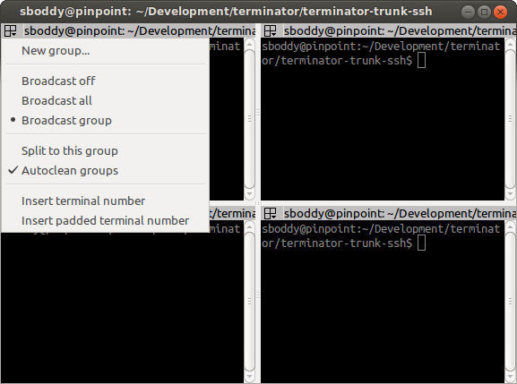
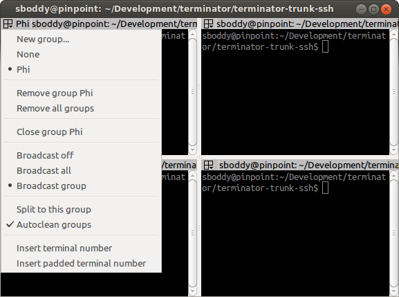
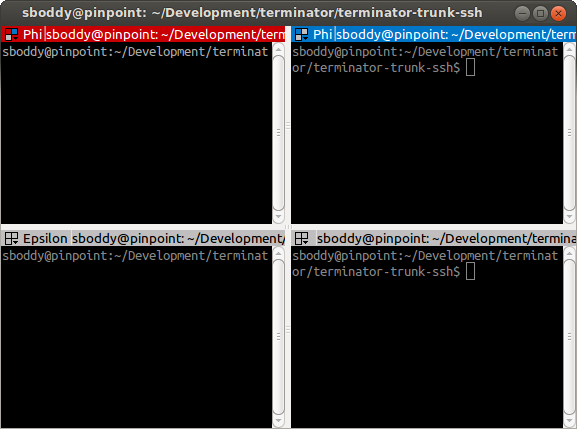

.. image:: imgs/icon_grouping.png
   :align: right
   :alt: Because nothing says grouping like three different coloured
         boxes... /s

.. _grouping-menu:

=================
The Grouping Menu
=================

----------------------------
Manipulating terminal groups
----------------------------

Grouping, as the name suggests, allows grouping of terminals allowing
actions to be taken that affect more than one terminal. As usual,
following along will help understanding, so lets start with a basic
window, then split into a 2x2 grid.

Let's have another look at the grouping menu for reference, because
as we proceed, it will change:

The first item **New group...** allows you to create a named group,
using an editable field that will appear next to the 3-box icon. By
default this will be given a randomly selected name from the names
of the Greek alphabet. Here you can see **Phi** was selected:

.. image:: imgs/grouping_02.png

You can either start typing to replace the provided one with something
more descriptive, or you can accept the default with ``Return``. For
the purpose of this document I will just be using default names.

If you again click the 3-box/group button, you will see that several
new entries have been added to the menu:

Because the terminal now has a group the first new entry is **None**
which will remove the grouping for this terminal.

Following that is a list of the known groups, in this case only *Phi*
so far. This list (plus the *None* entry) can be used to change the
group of this terminal.

Next are two items: **Remove group Phi** and **Remove all groups**.
You will only get the currently assigned group group as an option to
remove, as well as an option to remove all groups. This does not
close the group, but simply removes the group assignments from the
terminals.

The next option is more destructive: **Close group Phi** will exit
the terminals assigned to this group.

Here I've gone ahead and set the upper right terminal to the same
*Phi* group, and the lower left terminal to a *New group...* of
**Epsilon**.

A quick glance at the menu again will show that the only change is
the addition of the *Epsilon* group to the list.

To change a group name you can either click on *New group...* again,
or ``Shift``\ +\ ``click`` on the 3-box/group button, and the editable
field will reappear.

The current terminal is the one with focus. By clicking with key
modifiers on other terminals 3-box/group button we can speed up group
organisation. Here's a list of mouse actions (including some already
detailed):

+------------------------------------------------+---------------------------------------+------------------+
| Action                                         | Mouse                                 | Default Shortcut |
+================================================+=======================================+==================+
| Group menu popup                               | ``click``                             | (TBD)            |
+------------------------------------------------+---------------------------------------+------------------+
| Edit group for terminal                        | ``Shift``\ +\ ``click``               | (TBD)            |
+------------------------------------------------+---------------------------------------+------------------+
| Edit group for all terminals in the "group"    | ``Shift``\ +\ ``Super``\ +\ ``click`` | (TBD?)           |
+------------------------------------------------+---------------------------------------+------------------+
| Toggle to current terminals group [1]_         | ``Ctrl``\ +\ ``click``                |                  |
+------------------------------------------------+---------------------------------------+------------------+
| Toggle "group" to current terminals group [1]_ | ``Ctrl``\ +\ ``Super``\ +\ ``click``  |                  |
+------------------------------------------------+---------------------------------------+------------------+

.. [1] These shortcuts will only work if you use them on terminals
       that are *not* the current terminal.

.. warning:: The terminals with no named group are also considered a
             group. If you use one of the ``Super`` shortcuts on a
             terminal with no group, you will also include all the
             other terminals with no group.

Skipping slightly ahead in the menu, there are two options that make
more sense covered here. The **Split to this group**  (default: off)
option means that when you split the current terminal, the new one
will inherit the group of the current terminal. It is off by default
in which case new terminals have no group.

The second option **Autoclean groups** (default: on) will remove a
group from the menus group list when the last terminal with that
group is closed. If off groups will remain in the list until the
application exits, or the option is enabled.

.. note:: Not shown in the above screenshots, there are also menu
          items for grouping all terminals in a tab in the menu. They
          only appear once a new tab is created - **Group all in tab**
          and **Ungroup all in tab**.

Some final group related shortcuts are for grouping all terminals
at once, or grouping terminals in the same tab.

+------------------+-----------------------------------+
| Action           | Default Shortcut                  |
+==================+===================================+
| Group all        | ``Super``\ +\ ``G``               |
+------------------+-----------------------------------+
| Ungroup all      | ``Shift``\ +\ ``Super``\ +\ ``G`` |
+------------------+-----------------------------------+
| Group tab        | ``Super``\ +\ ``T``               |
+------------------+-----------------------------------+
| Ungroup tab      | ``Shift``\ +\ ``Super``\ +\ ``T`` |
+------------------+-----------------------------------+
| Group all toggle |                                   |
+------------------+-----------------------------------+
| Group tab toggle |                                   |
+------------------+-----------------------------------+

----------------------------------------
Broadcasting input to multiple terminals
----------------------------------------

So first let me describe some terminology (no pun intended).
**Broadcasting** is the act of sending your input to multiple
terminals. The current terminal (the one with the red titlebar by
default) is always the **broadcaster**. Any terminal that is in
the same group as the current terminal is a potential **receiver**.
I say potential because the act of broadcasting can be turned on
and off independently of the grouping.

This can be an invaluable time-saver when having to do active
investigation across multiple machines where you would be repeating
the same commands on each of them.

Terminator's titlebar is colour-coded to help you quickly see which
terminals are potential receivers, and whether they *will* receive
the broadcast input.

The titlebar is split into two parts. The leftmost part is the 
3-box/group button that has one of three background colours as defined
in the :ref:`prefs-global` tab of :ref:`preferences`:

- *Red* - The current terminal and broadcaster.
- *Blue* - A terminal that is in the same group as the broadcaster.
- *Grey* - A terminal in a different group, or no group.

The second part consists of the title, and uses the same colouring
to show the following:

- *Red* - The current terminal and broadcaster.
- *Blue* - A terminal that is acting as a receiver and will duplicate
  input from the broadcaster.
- *Grey* - A terminal that is not a receiver.

There are three settings for broadcasting, selected from the *Group
menu*. Following are an image of each of these modes, with ``test``
typed into the current broadcasting terminal:

- *Broadcast off*

  .. image:: imgs/broadcast_01.png

  Here you can see that only the current terminal receives input, even
  though the upper right terminal is also a part of the *Phi* group.

- *Broadcast all*

  .. image:: imgs/broadcast_02.png

  Here you can see that all terminals, including those in other groups,
  or with no group, receive the input.

- *Broadcast group* (default mode; can be changed in the
  :ref:`prefs-global` tab of :ref:`preferences`.)

  .. image:: imgs/broadcast_03.png

  Here you can see that only the terminal(s) in the same group in the
  same group as the broadcaster receive input.

Be careful with additional tabs, windows, or when you are zoomed or
maximised on a single terminal. Just because you cannot see a terminal
does not mean the terminal is not receiving. This can cause problems
if you are typing a destructive command without realising that this
command is going to other terminals.

Those with good eyesight may have spotted the other visual indicator
of the colours in the 3-box icon changing for the different status of
the terminals too. When you are zoomed or maximised, the presence of
blue in this icon might be the only visual indicator of receivers.

As with all things in Terminator, we have shortcuts to help you keep
your hands on the keyboard:

+-----------------+-------------------+
| Action          | Default Shortcut  |
+=================+===================+
| Broadcast off   | ``Alt``\ +\ ``O`` |
+-----------------+-------------------+
| Broadcast all   | ``Alt``\ +\ ``A`` |
+-----------------+-------------------+
| Broadcast group | ``Alt``\ +\ ``G`` |
+-----------------+-------------------+

.. warning:: It has become apparent that IBus causes problems with
             broadcast input. When multiple keystrokes are used to
             *compose* a letter, such as the ``AltGr``\ +\ ``[``
             followed by ``a``\ , ``o``\ , ``u`` keys to get **ä**,
             **ö**, **ü** characters for the German language.

             Instead of getting your composed letter in all receivers,
             you will only get the composed letter in the current
             terminal. If you copy and paste the character into the
             current terminal then it will be input into the
             receivers.

             You may not even realise that you are running IBus.
             Killing it will temporarily fix the problem. There is
             a fix for IBus and VTE, but only in the newer builds of
             VTE. For that we would need the experimental GTK3
             version of Terminator.

----------------------
Insert terminal number
----------------------

The last two menu items are slightly out of place here. They are the
same function as the shortcuts mentioned :ref:`here <insert-termnum_shortcut>`.
They were added early on when the broadcast feature was added, and
the argument could be made for removing them. So far no-one has
though, so for now they will stay here.

