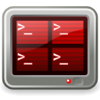

======================================
Welcome to Terminator's documentation!
======================================

This is the beginnings of a manual for Terminator. Sometimes it is not always
clear just how many little shortcuts and features there are in Terminator. This
guide hopes to reduce the confusion.

A quick word on style. I have none. 😃 I have an casual way of talking and writing,
and a strange sense of humour. I also tend to use random pop-culture references
a lot, but often in ways that make no sense. If this is a problem you are
entitled to a refund of the money you paid to me to write this... 😎

------------------
What is Terminator
------------------

At its simplest Terminator is a terminal emulator like xterm, gnome-terminal,
konsole, etc. At its most complex it lets you fly... metaphorically at least.
Take a look at the following list:

.. sidebar:: From the simple...

   .. image:: imgs/small_example.png
      :width: 100%

- Arrange terminals in a grid
- Tabs
- Drag and drop re-ordering of terminals
- Lots of keyboard shortcuts
- Save multiple layouts and profiles via GUI preferences editor
- Simultaneous typing to arbitrary groups of terminals

and lots more...

.. sidebar:: To the ridiculous...

   .. image:: imgs/large_example.png
      :width: 100% 

   In case it's not obvious this is faked up. I use more complex setups,
   but I'm not putting real work into the documentation.

.. toctree::
   :caption: Contents:
   :maxdepth: 2

   licensing
   history
   gettingstarted
   preferences
   layouts
   grouping
   plugins
   advancedusage
   faq
   gettinginvolved

.. Indices and tables
   ==================

.. * :ref:`genindex`
   * :ref:`modindex`
   * :ref:`search`

