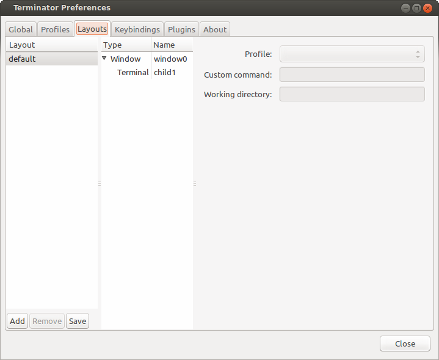

         the red backbround.

.. _layouts:

===============================
Layouts and the Layout Launcher
===============================

**Layouts** are how Terminator helps you quickly start a given set of
windows with the terminals arranged just how you like, and even
launching unique commands in each one.

You have already seen a glimpse of this in the :ref:`prefs-layouts`
tab of the :ref:`preferences`. Here it is again:

It's simple to create a new layout. Just launch new windows, add tabs
and splits, arrange them, and customise them to your liking.

Layouts will currently directly detect and save:

- Window sizes and positions as well as the  fullscreen or maximised  state
- Splitter positions
- Custom window, tab and titlebar names
- The profile of each terminal
- Group setting of each terminal
- The active terminal per window or tab, and the active tab per window if applicable
- The UUID of each terminal

When done, use the :ref:`prefs-layouts` section of the :ref:`preferences`
to keep this layout for future use. You save them by using the **Add**
or **Save** buttons, where *Add* creates a new layout entry and
prompts for a name, and *Save* updates the currently selected layout.

.. warning:: Currently some things are not detected by the code, and
             have to be configured in the :ref:`prefs-layouts` tab of
             the :ref:`preferences` *after* the layout is saved/added.
             
             This means that if you use the *Save* button in the
             :ref:`prefs-layouts` after spending time setting the 
             items below, you *will* lose these stored values.

             - Custom command
             - Working directory
             
             First get the layout right, then edit these within the
             :ref:`prefs-layouts` tab of the :ref:`preferences`. You
             do **not** need to use the *Save* button to keep these
             settings.
             
             There is potential to improve this behaviour.

.. _layout-launcher:

-------------------------------
The Layout Launcher
-------------------------------

You can set up an application launcher with the ``-l LAYOUT`` option
which will load the named layout, but what if you have a long list of
layouts, like me? It can be annoying distinguishing between 30 items
with the same icon, waiting for a tool-tip to tell you which one you're
about to launch. No-one has the stamina to draw 30 distinct icons
representing all these layouts either!

.. image:: imgs/layoutlauncher.png
   :align: right

Enter the **Layout Launcher**, as shown on the right. This will list
all of your saved layouts in alphabetical order, apart from
*default*, which is always at the top. You can ``double-click`` an
entry, highlight it and select **Launch**, or use the keyboard to move
the highlight, pressing ``Return`` to launch.

The *Layout Launcher* can be opened from a running terminal using a
shortcut, or by running Terminator with the ``-s`` option. This
option could be set in an application launcher, to get to the Layout
Launcher with a single click.

You can have more than one *Layout Launcher* window open, or you could
launch one at the beginning, and pin it to always be on the visible
workspace.

Here's a brief run-down of keyboard and mouse use:

+--------------------------+------------------+---------------------+
| Action                   | Mouse            | Default Shortcut    |
+==========================+==================+=====================+
| Open the Layout Launcher | N/A              | ``Alt``\ +\ ``L``   |
+--------------------------+------------------+---------------------+
| Move Up/Down list        | ``click``        | ``<Up/Down Arrow>`` |
+--------------------------+------------------+---------------------+
| Launch a layout          | ``double-click`` | ``Return``          |
+--------------------------+------------------+---------------------+

