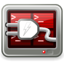
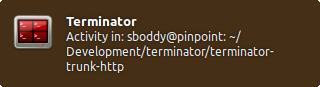

.. _plugins:

=======
Plugins
=======

Terminator can be expanded using plugins. Additional features can
be created outside of the main application, and added in at runtime.

In theory you should be able to implement fairly powerful plugins,
although so far the included ones we have are fairly small in scope.

The current plugins do not have configuration options in the
:ref:`prefs-plugins` tab of the :ref:`preferences`. The plugin
architecture was created before I (Steve Boddy) became maintainer,
and so far I haven't had reason to figure out the detail. I'm not
entirely sure if/how a plugin can add options to the configuration
options in the :ref:`prefs-plugins` tab. What plugins can definitely
do, because examples are below, is to:

- add menu items to :ref:`context-menu`,
- create their own windows,
- create handlers for strings that match a pattern.

.. note:: .. image:: imgs/plugins_links.png
             :align: center

          Several of the included plugins create :ref:`clickable-items` in
          the terminal. These are made apparent by underlining the
          item when the mouse hovers over it.

------------------------------
Included plugins
------------------------------

The following plugins are distributed by default with Terminator.

.. note:: Unless otherwise stated, the included plugins are under the
          :ref:`licencing` as Terminator, GNU GPL v2.

^^^^^^^^^^^^^^^^^^^^^^^^^^^^^^
Activity Watch
^^^^^^^^^^^^^^^^^^^^^^^^^^^^^^

Original Author: Chris Jones

Adds a menu item, **Watch for activity**, to :ref:`context-menu` which
will create a notification, as seen to the right, when there is output
to the terminal. This is useful when you have a long running command
and wish to know when it has completed, or output an update.

There is one option for this plugin:

**hush_period** (default: 10.0)

  How long in seconds until the next notification of activity is
  presented.

.. note:: There is currently no way to edit these options in the GUI,
          it must be done directly in :ref:`config-file`.

          An extract of this item being set would be::

            [plugins]
              [[ActivityWatch]]
                hush_period = 30.0

          Which would wait 30 seconds before showing another
          notification of activity.

^^^^^^^^^^^^^^^^^^^^^^^^^^^^^^
APT URL Handler
^^^^^^^^^^^^^^^^^^^^^^^^^^^^^^

Original Author: Chris Jones

Text matching ``apt:.*`` will be converted into a click-able item that
when triggered with ``Ctrl``\ +\ ``click`` will launch the default
package manager for software on a debian system.

``right-click`` over the URL will add two entries to :ref:`context-menu`:

- *Open software manager* - Same as ``Ctrl``\ +\ ``click``
- *Copy package URI* - Just copies the URI to the clipboard

^^^^^^^^^^^^^^^^^^^^^^^^^^^^^^
Custom Commands Menu
^^^^^^^^^^^^^^^^^^^^^^^^^^^^^^

Original Author: Chris Jones

Adds a menu item, **Custom Commands**, to :ref:`context-menu` which
has a sub-menu containing its own **Preferences** item that launches
the window show below. Below that is a list of user configured
commands that can be chosen.

.. image:: imgs/custom_commands.png
   :align: center

In this window you can create a **New** item, and **Edit** or
**Delete** existing ones. The selected item can be repositioned in
the sub-menu order using the **Top**, **Up**, **Down** and **Last**
buttons.

Clicking *New* or *Edit* gives the smaller window. An **Enabled**
item is shown in sub-menu, and a disabled one is not. The **Name** is
used for the sub-menu item text. The **Command** is the text that will
be entered into the current terminal with a ``Return`` at the end to
execute/enter it. You *do not* get a chance to edit the text first.

.. note:: If other terminals are receiving, they too will receive and
          execute the *Command*.

^^^^^^^^^^^^^^^^^^^^^^^^^^^^^^
Inactivity Watch
^^^^^^^^^^^^^^^^^^^^^^^^^^^^^^

Original Author: Chris Jones

.. image:: imgs/inactivitywatch_notification.png
   :align: right

Adds a menu item, **Watch for silence**, to :ref:`context-menu` which
will create a notification, as seen to the right, when a terminal has
been quiet for a given period. This is useful when you have a long
running process that outputs constantly (i.e. compiling a kernel) and
you wish to know when it has ended. This notification will only show
once, unless there is some activity in the terminal after the initial
notification.

There are two options for this plugin:

**inactive_period** (default: 10.0)

  How long in seconds until a terminal is considered inactive.

**watch_interval** (default: 5000)

  How long in milliseconds between checks for inactivity.

Be aware that this combination will result in some uncertainty as to
the exact timing of the notification. In the worst case, with the
values given, the notification may take 14.9 seconds to appear.

.. note:: There is currently no way to edit these options in the GUI,
          it must be done directly in :ref:`config-file`.

          An extract of these items being set would be::

            [plugins]
              [[InactivityWatch]]
                inactive_period = 30.0
                watch_interval = 1000

          Which would check every second if the terminal had been
          silent for 30 seconds.

^^^^^^^^^^^^^^^^^^^^^^^^^^^^^^
Launchpad Bug URL Handler
^^^^^^^^^^^^^^^^^^^^^^^^^^^^^^

Original Author: Chris Jones

Text matching ``lp: #12345`` where 12345 is a bug number in launchpad,
will be converted into a click-able item that when triggered with
``Ctrl``\ +\ ``click`` will launch a browser to the bug report in
launchpad.

Additionally the plugin will accept variants where the prefix is in
capitals, i.e. ``LP``, and the ``:``\ , white-space, and ``#`` are
optional.

The item can also be more than one bug number, and each will be opened,
for example:

  ``lp: #12345. #67890, 54321,#9876``

``Ctrl``\ +\ ``click`` on this will open four pages; one for each bug
number.

``right-click`` over the URL will add two entries to :ref:`context-menu`:

- *Open Launchpad bug* - Same as ``Ctrl``\ +\ ``click``
- *Copy bug URL* - Just copies the URL to the clipboard

^^^^^^^^^^^^^^^^^^^^^^^^^^^^^^
Launchpad Code URL Handler
^^^^^^^^^^^^^^^^^^^^^^^^^^^^^^

Original Author: Chris Jones

Text matching ``lp:string`` will be converted into a click-able item
that when triggered with ``Ctrl``\ +\ ``click`` will launch a browser
to the page in launchpad, where string is one of the following:

- *project* - i.e. lp:terminator
- *project/series* - i.e. lp:terminator/gtk3
- *group/project/branch* - i.e. lp:~sparkstar/terminator/terminator
- *group/+junk/branch* - i.e. lp:~<yourname>/+junk/terminator

Additionally the plugin will accept variants where the prefix is in
capitals, i.e. ``LP``.

``right-click`` over the URL will add two entries to :ref:`context-menu`:

- *Open Launchpad branch* - Same as ``Ctrl``\ +\ ``click``
- *Copy branch URL* - Just copies the URL to the clipboard

^^^^^^^^^^^^^^^^^^^^^^^^^^^^^^
Logger
^^^^^^^^^^^^^^^^^^^^^^^^^^^^^^

Original Author: Sinan Nalkaya

Adds a menu item, **Start Logger**, to :ref:`context-menu` which will
popup a window for selecting a file name to save as. Any content then
written to the terminal will be written to the file too. Once started
the menu item will change to **Stop Logger** which does precisely what
you would expect.

.. warning:: There appears to be problems when applications switch
             to/from alternate mode (i.e. vi, mc, etc.) The obvious
             one is that the alternate screen is not "logged"
             although it is not clear how this *could* be logged. The
             second issue is that some of the output after the
             alternate screen is not logged. See `LP#1477386`_ for
             more info and progress.

.. _LP#1477386: https://bugs.launchpad.net/terminator/+bug/1477386

^^^^^^^^^^^^^^^^^^^^^^^^^^^^^^
Maven Plugin URL Handler
^^^^^^^^^^^^^^^^^^^^^^^^^^^^^^

Original Author: Julien Nicoulaud

Ummmm..... I'm not entirely sure what this will do, as I don't use
Maven. Updates on a postcard, please...

From the source:

  Maven plugin handler. If the name of a Maven plugin is
  detected, it is turned into a link to its documentation site.
  If a Maven plugin goal is detected, the link points to the
  particular goal page. Only Apache (org.apache.maven.plugins)
  and Codehaus (org.codehaus.mojo) plugins are supported.

^^^^^^^^^^^^^^^^^^^^^^^^^^^^^^
Terminal Shot
^^^^^^^^^^^^^^^^^^^^^^^^^^^^^^

Original Author: Chris Jones

Adds a menu item, **Terminal screenshot**, to :ref:`context-menu`
that will take a screenshot of the underlying terminal, and present
a dialog for where to save it.

^^^^^^^^^^^^^^^^^^^^^^^^^^^^^^
Test Plugin
^^^^^^^^^^^^^^^^^^^^^^^^^^^^^^

Original Author: Chris Jones (most likely)

An almost comically stripped down example.

------------------------------
Third party plugins
------------------------------

As I find (or I'm told about) plugins that are available elsewhere,
I'll add links here. I've done a preliminary search, and.. Wow! I
never knew there were so many out there.

If any of the authors would like to get their plugins added to the
main Terminator package, or they would prefer not to be listed here
for some reason, they can reach out to me through the project site
on Launchpad and we can sort it out.

I'm unsure of how these plugins are perceived. They are specific to
Terminator, but does that make them derivative in the eyes of GPL v2,
and therefore allow me to include them? If I want to include one in
the main package, do I have to hope the creator is still active?
Answers on a postcard...

.. warning:: I have done no testing or checking of these plugins. You
             use at your own risk, and you are responsible for
             evaluating the code for bugs, issues, and security.

In absolutely no order at all...

https://github.com/rail/dotfiles/blob/master/terminator_bugzilla_handler.py
  - terminator_bugzilla_handler: Link "bug:12345" to the Mozilla bugzilla.
    (As it is for Mozilla, it seems a bit misnamed.)

https://github.com/ilgarm/terminator_plugins
  - clone_session: Split and clone ssh session

https://github.com/arnaudh/terminator-plugins
  - open_any_file_plugin: Open any file with it's default application

https://github.com/dr1s/terminator-plugins
  - cluster_connect: A way to connect to multiple machines as a cluster

https://github.com/mchelem/terminator-editor-plugin
  - editor_plugin: Click on file\:line style links to launch a text editor

https://github.com/camillo/TerminatorPlugins
  - LayoutManager: Saves and restores Layouts (which is built-in now, possibly redundant)
  - TerminalExporter: Export contents to file

https://github.com/choffee/terminator-plugins
  - searchplugin: Search Google for the selected text in a terminal

https://github.com/papajoker/editor_terminator
  - editor_plugin: Another text editor launcher

https://github.com/papajoker/git_terminator
  - git_plugin: adds commands for git when it detects a .git folder

https://github.com/iambibhas/terminator-plugins
  - hastebin: Uploads selected text to Hastebin and opens browser on it

https://github.com/abourget/abourget-terminator
  - TenscoresPlugin: Seems to be for launching set of tabs (which is built-in now, possibly redundant)

https://github.com/mikeadkison/terminator-google
  - google: Another google-the-text plugin

https://github.com/mariolameiras/ssh-menu-terminator
  - ssh_menu: I'm guessing a bit, but I think it works with SSH Menu ;-) the code is quite big to understand at a glance.

https://github.com/alesegdia/terminator-plugins
  - Session: Save/load sessions (which is built-in now, possibly redundant)

https://github.com/Theer108/colorize
  - colorize: Colour titlebar of each terminal separately

https://github.com/ju1ius/clisnips
  - clisnips: Snippets for the command line.

https://github.com/GratefulTony/TerminatorHostWatch
  - hostWatch: Attempts to figure out your current host, and apply a certain theme.

https://github.com/kmoppel/dumptofile
  - dump_to_file: Dump console contents to a text file.

https://bitbucket.org/pgularski/terminator-plugins
  - show_titlebar: Menu item to show/hide the titlebar.
  - searchplugin: Yup, another Googler.

https://bitbucket.org/johnsanchezc/terminator-applauncher
  - applauncher: A launcher/set-up tool (which is built-in now, possibly redundant)

https://www.snip2code.com/Snippet/58595/Terminator-plugin----log-the-output-of-t
  - my_logger: Log the output to a file with a time-stamp as the name, and prefix each line with the time.
    (Seems to be similar to, or derived from, the included one)

------------------------------
Installing a plugin
------------------------------

A plugin can be installed by adding the main python file (along with
any additional files) in one of two locations:

``/usr/[local/]share/terminator/terminatorlib/plugins/``
  This will need root permissions to do.   The optional ``local/`` is
  usually for packages installed by hand, rather  than through the
  package manager, and this depends on how Terminator was installed
  on your system.
``~/.config/terminator/plugins/``
  This allows you to use plugins without needing root.

------------------------------
Creating your own plugins
------------------------------

.. note:: The following guide is initially sourced from a `tutorial`_
          written by Chris Jones back in April 2010. I'm reproducing
          it here as a precaution, although I don't expect the
          original will disappear. It will get rewritten and expanded
          as more knowledge and information is added.

.. _tutorial: http://www.tenshu.net/2010/04/writing-terminator-plugins.html

One of the features of the new 0.9x series of Terminator releases
that hasn't had a huge amount of announcement/discussion yet is the
plugin system. I've posted previously about the decisions that went
into the design of the plugin framework, but I figured now would be
a good time to look at how to actually take advantage of it.

While the plugin system is really generic, so far there are only two
points in the Terminator code that actually look for plugins - the
Terminal context menu and the default URL opening code. If you find
you'd like to write a plugin that interacts with a different part of
Terminator, please let me know, I'd love to see some clever uses of
plugins and I definitely want to expand the number of points that
plugins can hook into.

^^^^^^^^^^^^^^^^^^^^^^
The basics of a plugin
^^^^^^^^^^^^^^^^^^^^^^

A plugin is a class in a ``.py`` file in ``terminatorlib/plugins`` or
``~/.config/terminator/plugins``, but not all classes are automatically
treated as plugins. Terminator will examine each of the .py files it
finds for a list called ``available`` and it will load each of the
classes mentioned therein.

Additionally, it would be a good idea to import ``terminatorlib.plugin``
as that contains the base classes that other plugins should be derived
from.

A quick example:

.. code-block:: python

  import terminatorlib.plugin as plugin
  available = ['myfirstplugin']
  class myfirstplugin(plugin.SomeBasePluginClass):
    # etc.

So now let's move on to the simplest type of plugin currently available
in Terminator, a URL handler.

^^^^^^^^^^^^
URL Handlers
^^^^^^^^^^^^

This type of plugin adds new regular expressions to match text in the
terminal that should be handled as URLs. We ship an example of this
with Terminator, it's a handler that adds support for the commonly
used format for Launchpad. Ignoring the comments and the basics above,
this is ultimately all it is:

.. code-block:: python

  class LaunchpadBugURLHandler(plugin.URLHandler):
    capabilities = ['url_handler']
    handler_name = 'launchpad_bug'
    match = '\\b(lp|LP):?\s?#?[0-9]+(,\s*#?[0-9]+)*\\b'

    def callback(self, url):
      for item in re.findall(r'[0-9]+', url):
        return('https://bugs.launchpad.net/bugs/%s' % item)

That's it! Let's break it down a little to see the important things
here:

- inherit from plugin.URLHandler if you want to handle URLs.
- include 'url_handler' in your capabilities list
- URL handlers must specify a unique handler_name (no enforcement of
  uniqueness is performed by Terminator, so use some common sense with
  the namespace)

- Terminator will call a method in your class called callback() and
  pass it the text that was matched. You must return a valid URL
  which will probably be based on this text.

And that's all there is to it really. Next time you start terminator
you should find the pattern you added gets handled as a URL!

^^^^^^^^^^^^^^^^^^
Context menu items
^^^^^^^^^^^^^^^^^^

This type of plugin is a little more involved, but not a huge amount
and as with URLHandler we ship an example in
``terminatorlib/plugins/custom_commands.py`` which is a plugin that
allows users to add custom commands to be sent to the terminal when
selected. This also brings a second aspect of making more complex
plugins - storing configuration. Terminator's shiny new configuration
system (based on the excellent ConfigObj) exposes some API for plugins
to use for loading and storing their configuration. The nuts and bolts
here are:

.. code-block:: python

  import terminatorlib.plugin as plugin
  from terminatorlib.config import Config
  available = ['CustomCommandsMenu']

  class CustomCommandsMenu(plugin.MenuItem):
    capabilities = ['terminal_menu']
    config = None

    def __init__(self):
      self.config = Config()
      myconfig = self.config.plugin_get_config(self.__class__.__name__)
      # Now extract valid data from sections{}

    def callback(self, menuitems, menu, terminal):
      menuitems.append(gtk.MenuItem('some jazz'))

This is a pretty simplified example, but it's sufficient to insert a
menu item that says "some jazz". I'm not going to go into the detail
of hooking up a handler to the 'activate' event of the MenuItem or
other PyGTK mechanics, but this gives you the basic detail. The method
that Terminator will call from your class is again "callback()" and
you get passed a list you should add your menu structure to, along
with references to the main menu object and the related Terminal. As
the plugin system expands and matures I'd like to be more formal about
the API that plugins should expect to be able to rely on, rather than
having them poke around inside classes like Config and Terminal.
Suggestions are welcome :)

Regarding the configuration storage API - the value returned by
Config.plugin_get_config() is just a dict, it's whatever is currently
configured for your plugin's name in the Terminator config file.
There's no validation of this data, so you should pay attention to it
containing valid data. You can then set whatever you want in this
dict and pass it to Config().plugin_set_config() with the name of
your class and then call Config().save() to flush this out to disk
(I recommend that you be quite liberal about calling save()).

^^^^^^^
Wrap up
^^^^^^^

Right now that's all there is to it. Please get in touch if you have
any suggestions or questions - I'd love to ship more plugins with
Terminator itself, and I can think of some great ideas. Probably the
most useful thing would be something to help customise Terminator for
heavy ssh users (see the earlier fork of Terminator called
'ssherminator')
